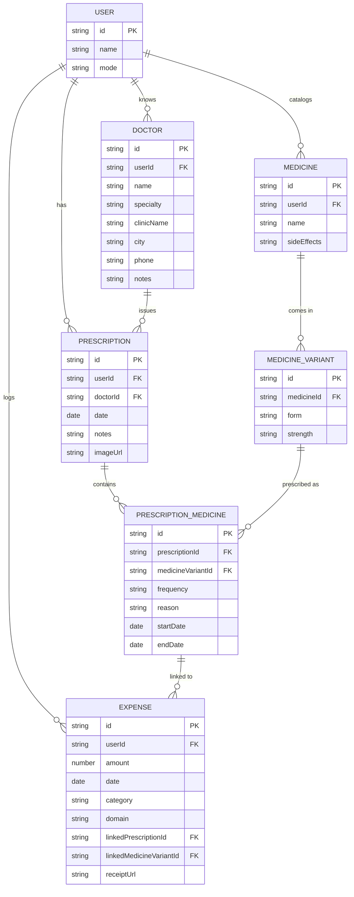

# CareCoin — Planning & Architecture Guide

**Contents**

1. [About the project](#1-about-the-project)
2. [Schema (data model)](#2-schema-data-model)
3. [MFE architecture](#3-mfe-architecture)
4. [Folder structure](#4-folder-structure)
5. [Sidebar / pages nav list](#5-sidebar--pages-nav-list)
6. [Routing guide](#6-routing-guide)

---

## 1. About the project

A personal health tracker starting as a single app, built so it can split into independently deployable micro-frontends (MFEs) without a rewrite.

| Version | Scope                                                                                         |
| ------- | --------------------------------------------------------------------------------------------- |
| v1      | Medicine tracker + prescriptions + medical expenses (single React app)                        |
| v2      | General expense manager added as a second domain                                              |
| v3      | User picks mode at onboarding — Health / Expense / Both — nav and dashboard adapt accordingly |

**Why MFE-ready now**: Health and Expense are already modeled as separate domains in v1. Structuring folders/data/routing along that seam today means extracting either into its own remote later is a config change, not a refactor.

**Stack**: React + TypeScript, Vite, React Router, shadcn/ui, Yarn workspaces, Jest + RTL.

---

## 2. Schema (data model)

### Entities

> **v1 note**: single-user app for now — `User` entity and `userId` FKs below are kept in the schema but unused (not enforced/queried) until multi-user support is actually needed. `mode` lives as an app-level setting in v1/v2 instead of on `User` — see design notes.

**User** _(reserved — not active until multi-user is needed)_
| Field | Notes |
|---|---|
| `id` | PK |
| `name` | |
| `mode` | `'health' \| 'expense' \| 'both'` — added in v3 |

**Medicine** — catalog of just the drug identity, deduped by name
| Field | Notes |
|---|---|
| `id` | PK |
| `userId` | FK |
| `name` | |
| `sideEffects?` | free text — side effects, allergies, anything worth remembering about this drug; dates included inline by the user if relevant |

**MedicineVariant** — one row per form + strength combination for a medicine
| Field | Notes |
|---|---|
| `id` | PK |
| `medicineId` | FK |
| `form?` | `'tablet' \| 'syrup' \| ...` — optional; unset until filled in via quick-create flow, see pattern doc |
| `strength?` | e.g. `'500mg'`, `'250ml'` — free text; optional for the same reason `form` is — quick-create shouldn't block on knowing both |

**Doctor**
| Field | Notes |
|---|---|
| `id` | PK |
| `userId` | FK |
| `name` | |
| `specialty?` | e.g. "Orthopedic," "General Physician" |
| `clinicName?` | |
| `city?` | disambiguates doctors/clinics across different cities |
| `phone?` | |
| `notes?` | |

**Prescription**
| Field | Notes |
|---|---|
| `id` | PK |
| `userId` | FK |
| `doctorId` | FK — replaces `doctorName` |
| `date` | when the doctor issued the prescription |
| `notes?` | |
| `imageUrl?` | |

**PrescriptionMedicine** — join entity, one row per medicine variant per prescription
| Field | Notes |
|---|---|
| `id` | PK |
| `prescriptionId` | FK |
| `medicineVariantId` | FK — replaces `medicineId`; dosage is implied by the variant's `strength`, not duplicated here |
| `frequency` | |
| `reason?` | free text — symptom/condition this was prescribed for, e.g. "back pain"; enables finding "what did I take last time for X" across prescriptions |
| `startDate` | when this medicine begins — may differ from `Prescription.date` |
| `endDate?` | |

**Expense**
| Field | Notes |
|---|---|
| `id` | PK |
| `userId` | FK |
| `amount` | |
| `date` | |
| `category` | |
| `domain` | `'health' \| 'general'` — `'general'` arrives in v2 |
| `linkedPrescriptionId?` | |
| `linkedMedicineVariantId?` | replaces `linkedMedicineId?` — price tracking needs to know which variant (form + strength) was bought |
| `receiptUrl?` | |

**ExpenseCategory** (v2)
| Field | Notes |
|---|---|
| `id` | PK |
| `name` | |
| `domain` | `'health' \| 'general'` |

### Relationships



### Design notes

- `Medicine` now holds only drug identity (`name`) — `form`, `strength`, and `price` move together as one unit because they vary together: the same drug in a different form or strength has a different price, so they can't be independent flat fields on `Medicine`.
- `MedicineVariant` is the "SKU" of a medicine — one row per form+strength combination, each with its own `referencePrice`. `PrescriptionMedicine` and `Expense` reference a specific variant, not the medicine directly.
- Dosage is no longer a separate field on `PrescriptionMedicine` — it's implied by `MedicineVariant.strength`, avoiding duplicating the same fact in two places.
- `Medicine detail` page lists its variants (with prices), and shows prescription history by listing `PrescriptionMedicine` rows across all variants of that medicine.
- The quick-create combobox pattern (see `react-patterns-learned.md`) now applies at two levels: create/select a `Medicine`, then create/select a `MedicineVariant` (form + strength) under it — same pattern, one more hop.
- `Expense.domain` exists from v1 even though only `'health'` is used — avoids a migration when v2 adds general expenses.
- Foreign keys (`prescriptionId`, `linkedMedicineVariantId`, etc.) are the only coupling between Health and Expense entities — keep it that way so each domain can own its own store independently.
- `userId` on `Medicine`, `Prescription`, and `Expense` is kept in the schema now (cheap insurance) but not populated/used in v1 — avoids a migration touching every table if multi-user is added later.
- `mode` is an app-level setting (local storage / `AppSettings` singleton) in v1/v2, not read from `User`, since there's no `User` row yet. Move it onto `User` only when multi-user actually lands.
- `MedicineVariant.form` is optional, not required — the quick-create combobox only captures the minimum needed at creation time for speed; `form` and `referencePrice` are filled in later from the Medicine detail page. UI should nudge but not block on this being empty.
- `Doctor` is its own entity (not a flat string on `Prescription`) since doctors are reused across prescriptions and their details (specialty, clinic, city) are worth preserving. `city?` exists specifically to disambiguate doctors across multiple cities in the user's history. Same quick-create combobox pattern applies — create/select inline from the Prescription form, other fields filled in later.

---

## 3. MFE architecture

**Pattern**: Host (shell) + Remotes, using Vite Module Federation.

```
Host (shell)
├─ Sidebar, top nav, auth, mode picker, routing shell
├─ Loads remotes dynamically based on active mode
└─ Owns: shared-ui, shared-types, api-client

Remotes (deployed separately, later)
├─ health-remote    → Medicines, Prescriptions, Health Expenses
├─ expense-remote   → General Expenses (v2+)
└─ dashboard-remote → Combined summary (v3, reads from both)
```

| Stage                        | What happens                                                                                                                                                                        |
| ---------------------------- | ----------------------------------------------------------------------------------------------------------------------------------------------------------------------------------- |
| v1–v2                        | Everything lives in one Vite app but is _organized_ as if each remote were separate (own folder, own local state, no cross-imports except through `shared-types` / `shared-ui`)     |
| v3 trigger to actually split | When a domain needs independent deploys, scaling, or a separate team — swap its folder into a real Module Federation remote; the host's dynamic import boundary is already in place |
| Shared contracts             | `shared-types` (schema above) and `shared-ui` (design system) are the only things both host and remotes import from                                                                 |

**Open gap**: `dashboard-remote` (v3, combined summary) has no home in section 4 yet — until v3, house it under `core/app/` since it reads from both features and belongs to the shell.

---

## 4. Folder structure

Single Vite app for now (v1/v2) — `apps/` + `packages/` workspace split from section 3 only kicks in at the v3 MFE split. Until then, the same boundaries are enforced _inside_ `src/`.

```
carecoin/
└─ src/
   ├─ assets/                  # icons, images, fonts
   │
   ├─ core/                    # host/shell concerns — becomes apps/host at v3
   │  ├─ app/                  # root App, providers, mode context
   │  ├─ layout/                # Sidebar, TopNav, PageShell
   │  └─ routes/                # route config, lazy-loaded feature entries
   │
   ├─ features/                # domain modules — each becomes its own remote at v3
   │  ├─ health/                # → apps/health-remote (v3)
   │  │  ├─ medicines/          # components, hooks, store, tests
   │  │  ├─ prescriptions/
   │  │  └─ expenses/           # domain: 'health'
   │  └─ expense/                # → apps/expense-remote (v3, added in v2)
   │
   ├─ shared/                  # → packages/shared-* (v3)
   │  ├─ types/                 # schema/interfaces (section 2)
   │  ├─ ui/                     # shadcn/ui-based components, design tokens
   │  └─ api/                    # fetch/query layer, one client per feature
   │
   └─ test/                    # test utils, setup, RTL helpers
```

**Rule**: nothing inside `features/health/*` imports from `features/expense/*` or vice versa — only through `shared/types` or `shared/ui`. This is the same boundary as section 3, just living inside one app instead of separate packages — which is exactly what makes the v3 split (`features/health` → `apps/health-remote`) a folder move + federation config, not a rewrite.

---

## 5. Sidebar / pages nav list

| Section          | Icon     | Module  | Visible in mode       |
| ---------------- | -------- | ------- | --------------------- |
| Dashboard        | home     | host    | Health, Expense, Both |
| Medicines        | pill     | health  | Health, Both          |
| Prescriptions    | file     | health  | Health, Both          |
| Health expenses  | receipt  | health  | Health, Both          |
| General expenses | wallet   | expense | Expense, Both (v2+)   |
| Settings         | settings | host    | Health, Expense, Both |

Mode filtering is a single lookup in the host layout — no per-page logic needed.

---

## 6. Routing guide

| Route                | Resolves to                                                  |
| -------------------- | ------------------------------------------------------------ |
| `/`                  | Dashboard (host)                                             |
| `/medicines`         | List (health module)                                         |
| `/medicines/:id`     | Detail — dosage/frequency history via `PrescriptionMedicine` |
| `/prescriptions`     | List (health module)                                         |
| `/prescriptions/:id` | Detail                                                       |
| `/expenses`          | List (health module, `domain=health`, v1)                    |
| `/expenses/general`  | List (expense module, `domain=general`, v2)                  |
| `/expenses/:id`      | Detail (either module, resolved by `domain`)                 |
| `/settings`          | Host                                                         |

**Guidelines**

- Each module owns its own route sub-tree and exports a route config object — the host imports and merges these, never hardcodes a module's internal paths.
- Routes are lazy-loaded (`React.lazy`) per module folder now, so swapping a lazy import for a Module Federation remote import later is a one-line change.
- Mode context (from Settings/onboarding) gates which route configs the host merges in — not the router itself, so no route guards needed in v1/v2.
- `/expenses/:id` needs a `domain` param or lookup to route to the correct module's detail component once both exist (v2+).

---

**See also**: [`react-patterns-learned.md`](./react-patterns-learned.md) — reusable UI/architecture patterns discovered while building this app (e.g. inline "search or create" comboboxes), kept separate since they apply beyond CareCoin.
